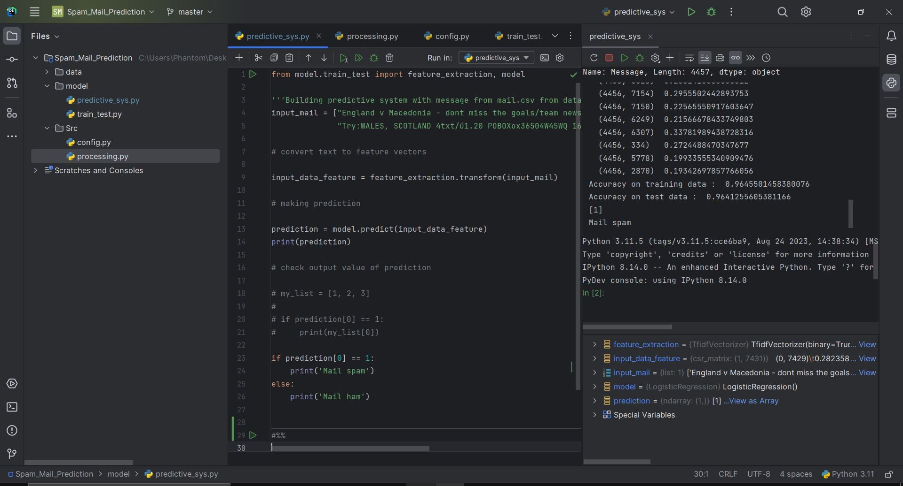

## Email Classification (Spam or Ham) Project
### Overview
- This project is designed for email classification, specifically to classify emails into two categories: "spam" and "ham" (non-spam). The core of this project lies in machine learning, where a Logistic Regression model is trained to make predictions based on the content of email messages.

### Code Structure
- The project code is organized into several key sections:

1. Data Loading and Preprocessing
Raw email data is loaded and cleaned.
Null values in the dataset are replaced with empty strings.
The data is labeled, with "spam" encoded as 0 and "ham" as 1.
Feature data (X) and target labels (Y) are separated.

2. Data Splitting
The dataset is split into training and testing subsets.
80% of the data is used for training, while the remaining 20% is reserved for testing.

3. Feature Extraction
Text data is transformed into numerical feature vectors using the TF-IDF (Term Frequency-Inverse Document Frequency) vectorization technique.
Parameters such as minimum document frequency, stop word removal, and lowercase conversion are applied.

4. Model Training
A Logistic Regression model is initialized.
The model is trained using the training feature vectors and target labels.

5. Model Evaluation
The accuracy of the model is evaluated on both the training and testing datasets.
Accuracy scores are printed to assess model performance.

6. Predictive System
An example of a predictive system is provided, showing how the trained model can classify new email messages.

- A sample email message is converted into a feature vector, and the model predicts whether it's spam or ham.

#### To use this project for email classification:

- Ensure you have the required libraries installed (NumPy, Pandas, scikit-learn).
- Prepare your email dataset and update the code to load and preprocess your data.
- Train the Logistic Regression model on your data.
- Evaluate the model's accuracy.
- Utilize the trained model to classify new email messages.

#### Fig.1 Input a spam message and program show the result
